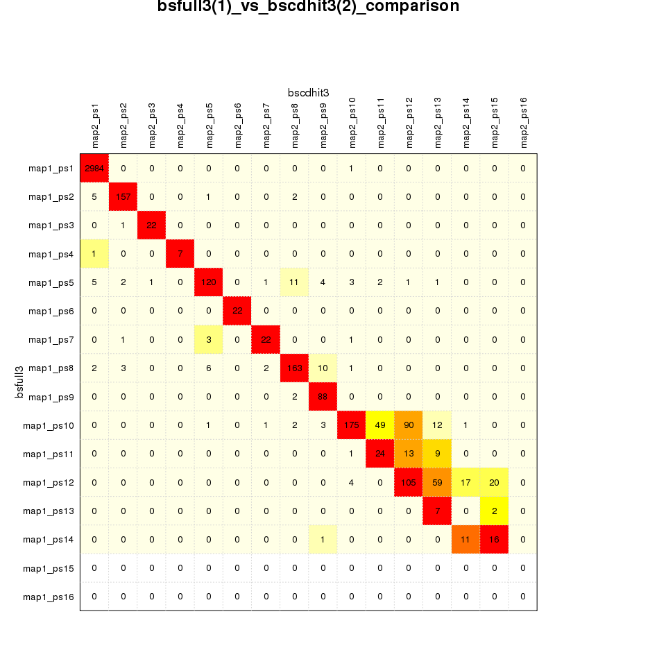

CompareMaps documentation
================

NAME
====

CompareMaps - It's an R script to compare two phylostratigraphic maps and visualize this comparison using heatmap.

SYNOPSIS
========

``` r
CompareMaps.R --map1 file --map2 file --out outdir

CompareMaps.R --map1 ./t/data/bsfull3.phmap_names --map2 ./t/data/bscdhit3.phmap_names --out ./t/data/
```

DESCRIPTION
===========

This R script takes as input two maps generated by PhyloStrat software. That means they have headers with phylogeny information + stratified genes in the body of document. It uses data.table to calculate joins between all phylostrata of one map and all phylostrata of other map. After that it plots this grid onto a heatmap and it prints this plot into pdf and png files. It also writes map comparison into .tsv, .xlsx and .Rdata files.

``` r
load(file="./t/data/my_grid.Rdata")
my_heatmap(my_grid, Colv = NA, Rowv = NA, scale="row", col=rev(heat.colors(20)),
    main=paste("bsfull3", "(1)_vs_", "bscdhit3", "(2)_comparison", sep=""), xlab="bscdhit3", ylab="bsfull3")
```



AUTHOR
======

Martin Sebastijan Šestak (<martin.s.sestak@gmail.com>)

LICENCE AND COPYRIGHT
=====================

Copyright (c) 2016-2017 Martin Sebastijan Šestak. All rights reserved.

This module is free software; you can redistribute it and/or modify it under the GPL version 3.

This program is distributed in the hope that it will be useful, but WITHOUT ANY WARRANTY; without even the implied warranty of MERCHANTABILITY or FITNESS FOR A PARTICULAR PURPOSE.
